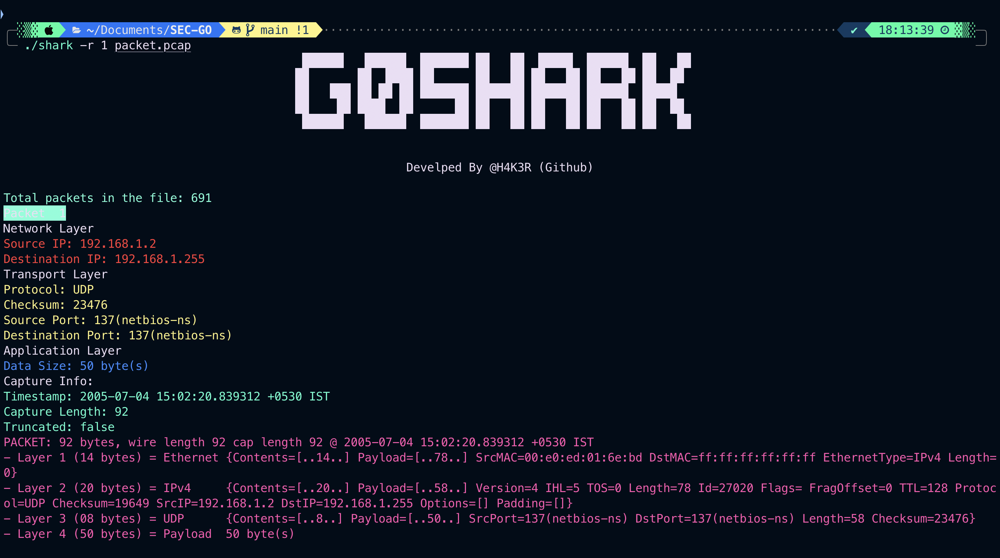

# G0Shark
This is a tool has similar features of Wireshark. Which can be used to read packets and get informations from it. developed using GO lang 


## Screenshots




## Tech Stack
- GO Lang
## How to run
Clone the repository
```bash
git clone https://github.com/H4K3R13/G0Shark.git
```
Change the directory
```bash
cd G0Shark
```
Install the modules
```bash
go mod download
```
Build 
```bash
go build -v ./shark.go
```
To read packets
```bash
./shark -r 2 packets.pcap
```

-r read packets 2 [number of packets to be read]

